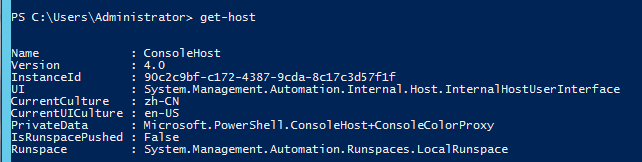
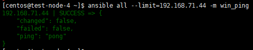
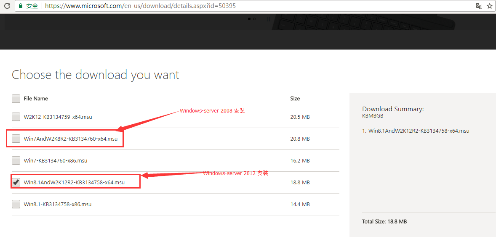

## 以windows server 2012 为例：

#### 1、查询powershell 版本： get-host

注意：如果在 3.0以下 需要升级到 3.0
[http://www.cnblogs.com/kingleft/p/6391652.html](http://www.cnblogs.com/kingleft/p/6391652.html)

#### 2、将winrm的配置文件设置成下面配置，
> winrm set winrm/config/service ‘@{AllowUnencrypted="true"}‘

> winrm set winrm/config/service/auth ‘@{Basic="true"}‘

#### 3、配置 ansible host 进行测试：
> # ansible all --limit=xxx.xxx.xxx.xxx -m win_ping

4、进行 iis配置
[https://jingyan.baidu.com/article/90895e0ffb5c1764ec6b0bbb.html](https://jingyan.baidu.com/article/90895e0ffb5c1764ec6b0bbb.html)

5、升级 powershell 到5.0 （因为 zip\unzip等命令 5.0后支持），需要同步升级framework到 4.6(NDP462-KB3151800-x86-x64-AllOS-ENU.exe)
[Powershell 5 下载地址](https://www.microsoft.com/en-us/download/confirmation.aspx?id=50395) 

